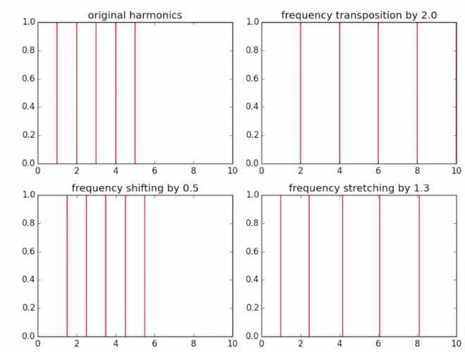

8A Peer-Assessment: Transformations
========= 

## Brief description of the transformation parameters

* freqScaling: frequency scaling factors to be applied to the harmonics of the sound, in time-value pairs (value of 1 is no scaling). The time values can be normalized, from 0 to 1, or can correspond to the times in seconds of the input sound. The scaling factor is a multiplicative factor, thus 1 is no change. Example: to transpose an octave the sound you can specify [0, 2, 1, 2].
* freqStretching: frequency stretching factors to be applied to the harmonics of the sound, in time-value pairs (value of 1 is no stretching). The time values can be normalized, from 0 to 1, or can correspond to the times in seconds of the input sound. The stretching factor is a multiplicative factor whose effect depend on the harmonic number, higher harmonics being more effected that lower ones, thus resulting in an inharmonic effect. A value of 1 results in no effect. Example: an array like [0, 1.2, 1, 1.2] will result in a perceptually large inharmonic effect.
* timbrePreservation: 1 preserves the original timbre, 0 it does not. It can only have a value of 0 or of 1. By setting the value to 1 the spectral shape of the original sound is preserved even when the frequencies of the sound are modified. In the case of speech it would correspond to the idea of preserving the identity of the speaker.
* timeScaling: time scaling factors to be applied to the whole sound, in time-value pairs (value of 1 is no scaling). The time values can be normalized, from 0 to 1, or can correspond to the times in seconds of the input sound. The time scaling factor is a multiplicative factor, thus 1 is no change. Example: to stretch the original sound to twice the original duration, we can specify [0, 0, 1, 2].

All the transformation values can have as many points as desired, but they have to be in the form of an array with time-value pairs, so of even size.   
For example a good array for a frequency stretching of a sound that has a duration of 3.146 seconds could be: [0, 1.2, 2.01, 1.2, 2.679, 0.7, 3.146, 0.7].

## Question 1. Obtain a good harmonic+stochastic analysis of a speech sound

Write a short paragraph for every transformation, explaining what you wanted to obtain and explaining the transformations you did, 
giving both the analysis and transformation parameter values (sufficiently detailed for the evaluator to be able to reproduce the analysis and transformation).  
upload transformed sound up to 3.

## Question 2. Perform creative transformations with a sound of your choice

Write a short paragraph for every transformation, explaining what you wanted to obtain and explaining the transformations you did, 
giving both the analysis and transformation parameter values (sufficiently detailed for the evaluator to be able to reproduce the analysis and transformation).   
upload transformed sound up to 3.

